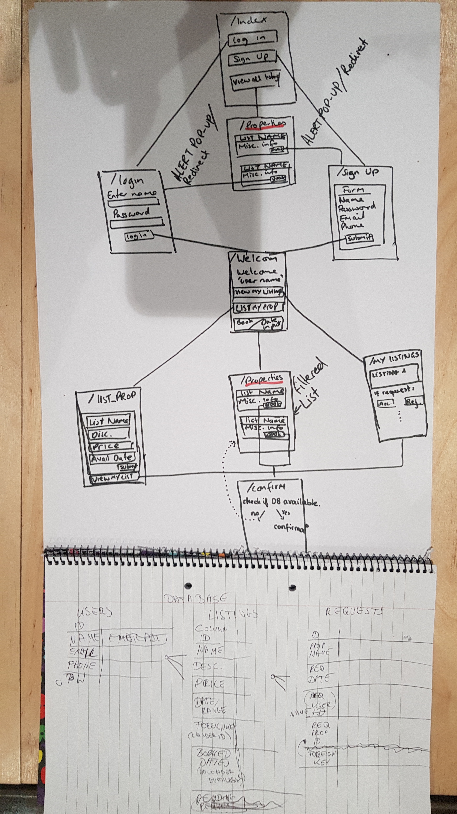

MakersBnB
-----

Domain Model


User stories:
---------

```
# Any signed-up user can list a new space.
As a user
So I can have an account
I would like to be able to sign up

As a user
So I can list or rent a property under my name
I want to be able to log in

# Any signed-up user can list a new space.
As a host
So I can rent out my property
I want to be able to list a new space

# Users can list multiple spaces.
As a host
So I can rent out multiple properties
I would like to be able to list more than one space

# Users should be able to name their space, provide a short description of the space, and a price per night.
As a host
So I can advertise my property
I would like to be able to show information on my property (name, description, price)

# Users should be able to offer a range of dates where their space is available.
As a host
So I can only rent my property when it's available
I would like to be able to show a range of available dates

# Any signed-up user can request to hire any space for one night, and this should be approved by the user that owns that space.
As a signed-up guest
So I can book a space
I would like to be able to request a booking for a particular date

# Any signed-up user can request to hire any space for one night, and this should be approved by the user that owns that space.
As a host
So I can choose to accept a request or not
I want to be able to see and approve/reject bookings on my space

# Nights for which a space has already been booked should not be available for users to book that space.
As a guest
To avoid disappointment
I do not want to be able to select and book dates that are not available

# Until a user has confirmed a booking request, that space can still be booked for that night.
As a host
So I do not lose any business
I want my space to be available until booking is confirmed
```
